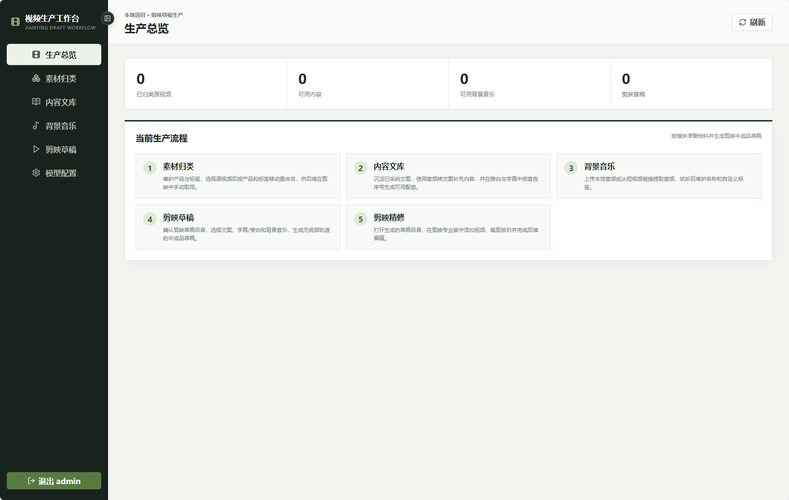
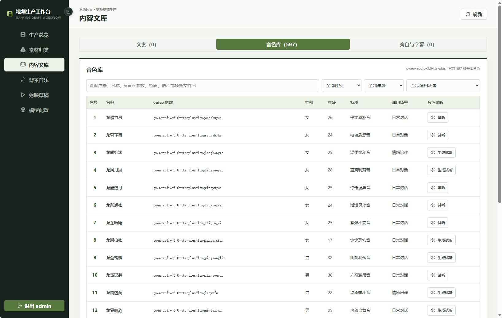

# 本地视频生产工作台

这是一个人工主导的产品短视频生产系统。人工确认原视频的产品与标签，系统按产品文件夹移动和重命名原视频；人工再从内容文库、旁白与字幕库和背景音乐库选择内容，直接生成可在剪映专业版继续编辑的草稿目录。

当前流程：

```text
选择原视频 → 确认产品和标签 → 移动到产品文件夹并重命名
→ 准备文案内容、旁白/字幕和背景音乐 → 人工选择资源 → 生成剪映草稿

“素材归类”支持直接新增、改名和删除产品名称；删除数据库关系不会移动或改名磁盘上的视频。
素材使用 Windows 标准文件窗口选择，可查看系统缩略图并多选视频；确认归类后直接移动原视频，不复制到工作区。
剪映草稿页可确认草稿目录，从三库中模糊查询并选择物料，生成不含视频轨道的半成品草稿。
剪映草稿名称带时间戳；重复物料组合会弹窗提示历史生成次数，但不阻止继续生成。
```

详细规则和当前工程状态见 [PROJECT_CURRENT.md](PROJECT_CURRENT.md)。

## 界面预览

生产总览展示当前物料数量、结果状态和人工生产流程。



内容文库用于沉淀文案、旁白字幕和音色资源。



## 本地运行

```bash
python3 -m venv .venv
source .venv/bin/activate
pip install -r requirements-dev.txt
.venv/bin/alembic upgrade head
npm --prefix frontend run build
```

开发方式：

```bash
bash scripts/run_dev.sh
```

用户级 systemd 服务：

```bash
systemctl --user status product-video-automation
systemctl --user restart product-video-automation
journalctl --user -u product-video-automation -f
```

本机打开 `http://127.0.0.1:8000/workbench/`。服务监听局域网接口，其他电脑可使用
`http://服务器局域网IP:8000/workbench/` 访问；首次访问时初始化管理员账号。

## 当前工作流 API

业务接口使用 `/api/v1`，素材、文案和剪映草稿子模块使用 `/api/v1/human`：

```text
POST      /material-classifications
GET       /classified-materials
GET       /classified-materials/{asset_id}/video

GET/POST  /api/v1/products
PATCH     /api/v1/products/{product_id}
GET/POST  /tag-categories
GET/POST  /tags

POST      /copies/iterations
POST      /copies/iterations/{record_id}/continue
GET/DELETE /copies/iterations[/{record_id}]
GET       /copies/library
PATCH     /copies/{content_id}/review

POST      /copies/audio-to-text
GET/POST  /narrations/...
GET       /narrations/{id}/audio
DELETE    /narrations/{id}
POST      /voice-preview
GET       /voice-catalog
GET       /voice-catalog/{sequence}
GET/POST  /jianying-drafts
POST      /jianying-drafts/duplicate-count
POST      /jianying-drafts/duplicate-counter/reset
DELETE    /jianying-drafts/{draft_id}

GET/PUT   /api/v1/model-profiles
GET/POST  /api/v1/music-resources/...
```

接口需要管理员 Bearer Token。完整定义以 `/openapi.json` 为准。

当前源码、ORM 和数据库不再包含旧人工粗剪、批次扫描、候选片段、质量审核、框架、卡点、
自动混剪、系统内渲染、成片和热播模块。历史 Alembic 文件保留用于旧库顺序升级。

生产环境只需要 `requirements.txt`；运行测试时安装 `requirements-dev.txt`。模型日志留存清理由
Web 服务内置任务执行，不需要 Redis 或独立 Worker。

## 输出

- 剪映草稿基线为竖屏 1080×1920、30fps
- 草稿直接写入已确认的剪映草稿目录，包含 `draft_content.json`、`draft_info.json`、`draft_meta_info.json`
- 草稿不生成视频轨道；文案、字幕/旁白和背景音乐分别写入文本与音频轨道
- 音频文件会复制到草稿本地 `assets/audio`，避免剪映打开后丢失音频引用

媒体探测和音乐提取需要 `ffmpeg`/`ffprobe`。健康检查：

```bash
curl -sS http://127.0.0.1:8000/api/health
```
