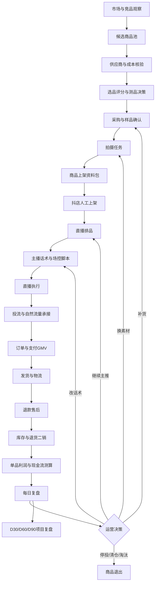
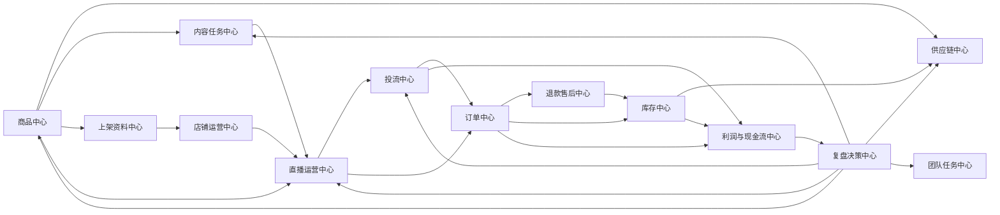

# ____项目运营业务逻辑拓扑与自动化边界

版本：V1.0  
日期：2026-08-11  
用途：交给其他AI或开发者，用于设计完整的直播电商运营AI辅助系统  

## 1. 设计目标

本系统要覆盖直播电商运营的完整业务链路，而不是只覆盖选品、上架或投流。

系统设计原则：

1. 所有运营动作必须进入业务链路，不允许只靠微信群、口头安排和临时表格。
2. 能自动化的环节，由系统自动生成、计算、预警或复盘。
3. 不能自动化的环节，必须标注人工负责人、确认动作、判断依据和留痕要求。
4. AI只做辅助判断，不替代平台后台最终操作、资金决策、合同决策、合规判断和质量判断。

## 2. 总体业务逻辑拓扑图

## 3. 自动化等级定义

| 等级 | 含义 | 处理方式 |
|---|---|---|
| A0 全自动 | 系统可根据规则直接生成结果 | 自动计算、自动生成、自动预警 |
| A1 半自动 | 系统生成建议，人工确认后执行 | AI初稿、运营确认、人工发布 |
| A2 人工主导 | 系统只能提供资料和检查清单 | 人工判断、人工签字、系统留痕 |
| A3 禁止自动 | 涉及重大风险，不能由系统自动执行 | 必须负责人确认，必要时专业人士复核 |

## 4. 业务环节自动化边界表

| 环节 | 输入 | 输出 | 自动化等级 | 可自动化内容 | 不能自动化内容 | 人工处理方式 |
|---|---|---|---|---|---|---|
| 市场与竞品观察 | 竞品直播间、商品价格、话术、素材 | 竞品观察记录 | A1 | 竞品记录模板、价格区间整理、话术拆解初稿 | 判断对方数据真实性、判断是否值得模仿 | 运营每周确认竞品清单和可借鉴点 |
| 候选商品池 | 1688链接、图片、供应商资料 | 候选商品表 | A1 | 自动整理商品名称、价格、规格、图片、卖点 | 商品审美、实物质感、是否适合国风定位 | 运营和供应链共同确认 |
| 供应商核验 | 供应商链接、价格、交期、退换条款 | 供应商评分 | A1 | 自动生成供应商评分表、风险清单 | 真实履约能力、质量稳定性、是否可长期合作 | 供应链负责人电话或实地核验并留痕 |
| 选品评分 | 商品资料、成本、售价、竞品 | A/B/C/D等级 | A1 | 自动生成评分初稿、毛利测算、测品建议 | 最终选品、采购数量、是否进入直播测试 | 运营负责人确认，必要时项目协调人确认 |
| 样品采购 | 采购价、数量、供应商 | 采购记录 | A2 | 自动生成采购单和预算占用 | 是否付款、付款账户、采购对象 | 供应链申请，项目负责人或销售公司确认 |
| 样品质检 | 实物、图片、材质、佩戴效果 | 质检结果 | A2 | 自动生成质检表和问题归类 | 实物质量、色差、佩戴舒适度、是否退换 | 供应链和主播/内容共同试用确认 |
| 拍摄任务 | 商品等级、主推卖点、上架需求 | 拍摄清单 | A1 | 自动生成主图、详情图、短视频脚本 | 审美、灯光、构图、最终成片质量 | 内容负责人拍摄，运营验收 |
| 修图与素材整理 | 原片、视频、主图要求 | 可用素材库 | A1 | 自动命名、分类、生成封面文案 | 是否符合平台和品牌调性 | 内容负责人确认 |
| 上架资料包 | 商品资料、素材、价格、库存 | 标题、详情页、SKU文案 | A1 | 自动生成标题、详情、卖点、售后说明 | 抖店后台最终发布、类目和资质确认 | 运营人工复制发布并截图留痕 |
| 商品定价 | 成本、竞品、毛利、退款率 | 售价和优惠结构 | A1 | 自动计算毛利、净利、盈亏平衡 | 最终售价、优惠力度、福利机制 | 运营提出，项目协调人确认重大改价 |
| 店铺基础设置 | 运费模板、售后、客服话术 | 店铺配置检查表 | A1 | 自动生成检查清单 | 后台实际设置和平台规则判断 | 运营人工设置，客服参与校验 |
| 直播排品 | 商品池、库存、利润、测品目标 | 排品表 | A1 | 自动生成顺序、讲解时长、商品角色 | 当场临时换品、主播状态判断 | 运营确认，主播和场控执行 |
| 主播话术 | 商品卖点、价格、用户痛点 | 话术卡 | A1 | 自动生成30秒/90秒话术、逼单话术 | 主播表达风格、临场互动、承接能力 | 主播训练后使用，运营复盘修订 |
| 场控脚本 | 排品表、优惠、库存 | 场控指令 | A1 | 自动生成上链接、库存、催单提醒 | 异常评论、投诉、违规风险判断 | 场控或运营现场处理 |
| 直播执行 | 主播、场控、商品、投流 | 场次数据 | A2 | 自动提供话术、提醒、记录模板 | 直播现场节奏、主播表现、突发情况 | 运营现场盯场并记录 |
| 商品推广投流 | 商品、素材、预算、ROI目标 | 投流计划 | A1 | 自动生成预算建议、ROI预警、停投建议 | 后台实际投放、预算放量、计划关闭 | 运营人工操作后台并记录 |
| 订单导入 | 抖店订单导出 | 每日订单表 | A0/A1 | CSV导入后自动清洗、统计 | 平台数据异常识别 | 运营或客服核对异常订单 |
| 退款售后 | 退款订单、原因、商品状态 | 退款分析 | A1 | 自动归类退款原因、高退款预警 | 争议订单处理、赔付、投诉应对 | 客服处理，运营复盘原因 |
| 发货物流 | 订单、库存、物流单号 | 发货记录 | A1 | 批量生成发货清单、超时预警 | 实际打包、称重、异常件处理 | 仓管客服人工执行 |
| 库存管理 | 订单、退货、采购、在途 | 库存预警 | A1 | 自动计算可售库存、补货建议 | 大额补货、滞销清仓决策 | 供应链提出，运营确认 |
| 退货二销 | 退货实物、质检结果 | 二销/报废记录 | A2 | 自动生成质检分类表 | 是否可二次销售、是否报废 | 仓管或供应链人工质检 |
| 单品利润 | 成本、售价、退款、投流、物流 | 单品净利 | A0 | 自动计算利润、亏损预警 | 成本真实性、税务口径最终确认 | 财务或会计复核关键口径 |
| 现金流测算 | 订单、回款周期、采购、费用 | 现金缺口 | A0/A1 | 自动测算资金缺口和预警 | 是否追加资金、是否扩张 | 项目协调人和资金方按协议决策 |
| 每日复盘 | 订单、退款、投流、库存、主播表现 | 日报和次日动作 | A1 | 自动生成日报、问题清单、建议 | 次日最终策略 | 运营负责人确认并分配任务 |
| 周复盘 | 7日数据 | 周报 | A1 | 自动生成趋势、爆品、亏损品、风险 | 是否调整团队、预算、货盘 | 项目协调人组织复盘 |
| D30/D60/D90复盘 | 阶段数据、财务、人员表现 | 阶段报告 | A1/A2 | 自动生成经营报告初稿 | 是否转全职、是否追加资金、是否停止项目 | 项目参与人按协议决策 |
| 合规风险 | 商品描述、IP授权、广告词、平台规则 | 风险提示 | A1/A3 | 自动检查敏感词、资料缺口 | 法律、税务、平台规则最终判断 | 专业人士或负责人复核 |
| 团队任务推进 | 各模块待办 | 任务看板 | A0/A1 | 自动生成待办、逾期提醒 | 人员协调、奖惩、清退 | 项目协调人和运营负责人处理 |

## 5. 系统模块拓扑

## 6. 决策闭环

### 6.1 商品闭环

候选商品进入商品池后，经过供应商核验、选品评分、样品采购、拍摄、上架、直播测试、订单和退款验证，最终进入以下状态之一：

- 主推：继续排品、投流、补货。
- 测试：小预算、小库存继续观察。
- 清仓：停止投流，降低库存。
- 淘汰：停止采购、停止排品、必要时下架。

系统可自动建议状态变化，但最终由运营负责人确认。

### 6.2 内容闭环

素材不是一次性交付。系统应根据点击率、进房成本、成交率、主播反馈和评论反馈，自动生成内容优化任务：

- 重拍主图。
- 重写标题。
- 修改详情页。
- 增加佩戴效果图。
- 生成短视频切片。
- 更换直播间展示角度。

内容负责人执行，运营负责人验收。

### 6.3 主播闭环

系统应记录每个主播在每个商品上的表现：

- 讲解时长。
- 商品点击。
- 成交订单。
- 退款后净GMV。
- 单品利润。
- 用户互动情况。

AI可以生成主播复盘和训练建议，但不能直接评价人员去留。涉及人员激励、退出、清退，必须按项目协议处理。

### 6.4 投流闭环

投流必须同时反馈给四个模块：

- 商品：判断是否值得继续推。
- 内容：判断是否换素材。
- 主播：判断话术是否调整。
- 库存：判断是否补货或停止补货。

不能只看GMV和表面ROI，必须看退款后净GMV和投流后利润。

### 6.5 售后闭环

退款和售后不是客服自己的事，必须反向影响：

- 选品。
- 详情页说明。
- 主播话术。
- 供应商质量。
- 包装方式。
- 补货决策。

系统应把退款原因自动归类，并生成“需要谁处理”的任务。

## 7. 不可自动化环节的处理机制

### 7.1 人工确认按钮

所有A1、A2、A3事项都必须有人工确认记录：

- 确认人。
- 确认时间。
- 确认结论。
- 依据数据。
- 附件或截图。

### 7.2 重大事项二次确认

以下事项必须二次确认：

- 单次大额采购。
- 投流预算显著放量。
- 商品大幅降价。
- 达人号或店铺权限变更。
- 资金追加。
- 转全职。
- 人员退出或清退。
- 涉及IP授权、平台违规、消费者投诉的处理。

### 7.3 系统建议和人工决策分离

系统输出应分成两栏：

- 系统建议：基于数据和规则自动生成。
- 人工决策：负责人最终选择，并填写原因。

这样可以防止后期争议中出现“系统让我们这么做”的责任不清。

## 8. MVP建议

第一版应优先做“数据闭环”，而不是追求复杂自动化。

P0优先级：

1. 商品中心。
2. 上架资料中心。
3. 直播排品中心。
4. 订单与退款导入。
5. 单品利润测算。
6. 每日复盘。
7. 团队任务看板。

P1优先级：

1. 投流中心。
2. 库存补货中心。
3. 主播训练中心。
4. 内容优化中心。
5. D30/D60/D90复盘中心。

P2优先级：

1. 浏览器自动化辅助上架。
2. 平台数据自动读取。
3. 多品牌、多店铺扩展。
4. 投资人简报自动生成。

## 9. 给开发AI的执行要求

开发时请把系统设计成“运营作业流”，不是单独的聊天机器人。每个模块都必须有输入、输出、状态、负责人、自动化等级和人工确认记录。

第一版允许人工导入数据，不要求直接连接抖店、巨量千川或其他平台后台。必须先保证商品、直播、投流、订单、退款、库存、利润、复盘之间的数据能互相流动。

任何涉及平台发布、投流放量、资金、合同、人员、税务、消费者投诉、IP授权和法律风险的事项，系统只能给出建议和检查清单，不能自动执行。

